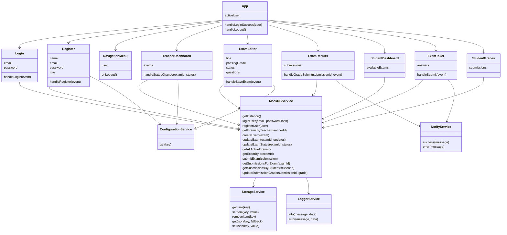

# ExamApp UML

```mermaid
classDiagram
  class App {
    activeUser
    handleLoginSuccess(user)
    handleLogout()
  }

  class Login {
    email
    password
    handleLogin(event)
  }

  class Register {
    name
    email
    password
    role
    handleRegister(event)
  }

  class NavigationMenu {
    user
    onLogout()
  }

  class TeacherDashboard {
    exams
    handleStatusChange(examId, status)
  }

  class ExamEditor {
    title
    passingGrade
    status
    questions
    handleSaveExam(event)
  }

  class ExamResults {
    submissions
    handleGradeSubmit(submissionId, event)
  }

  class StudentDashboard {
    availableExams
  }

  class ExamTaker {
    answers
    handleSubmit(event)
  }

  class StudentGrades {
    submissions
  }

  class MockDBService {
    getInstance()
    loginUser(email, passwordHash)
    registerUser(user)
    getExamsByTeacher(teacherId)
    createExam(exam)
    updateExam(examId, updates)
    updateExamStatus(examId, status)
    getAllActiveExams()
    getExamById(examId)
    submitExam(submission)
    getSubmissionsForExam(examId)
    getSubmissionsByStudent(studentId)
    updateSubmissionGrade(submissionId, grade)
  }

  class ConfigurationService {
    get(key)
  }

  class StorageService {
    getItem(key)
    setItem(key, value)
    removeItem(key)
    getJson(key, fallback)
    setJson(key, value)
  }

  class LoggerService {
    info(message, data)
    error(message, data)
  }

  class NotifyService {
    success(message)
    error(message)
  }

  App --> Login
  App --> Register
  App --> NavigationMenu
  App --> TeacherDashboard
  App --> ExamEditor
  App --> ExamResults
  App --> StudentDashboard
  App --> ExamTaker
  App --> StudentGrades
  Login --> MockDBService
  Register --> MockDBService
  TeacherDashboard --> MockDBService
  ExamEditor --> MockDBService
  ExamResults --> MockDBService
  StudentDashboard --> MockDBService
  ExamTaker --> MockDBService
  StudentGrades --> MockDBService
  MockDBService --> StorageService
  MockDBService --> LoggerService
  Register --> ConfigurationService
  ExamEditor --> ConfigurationService
  TeacherDashboard --> ConfigurationService
  ExamTaker --> NotifyService
  ExamResults --> NotifyService
```
